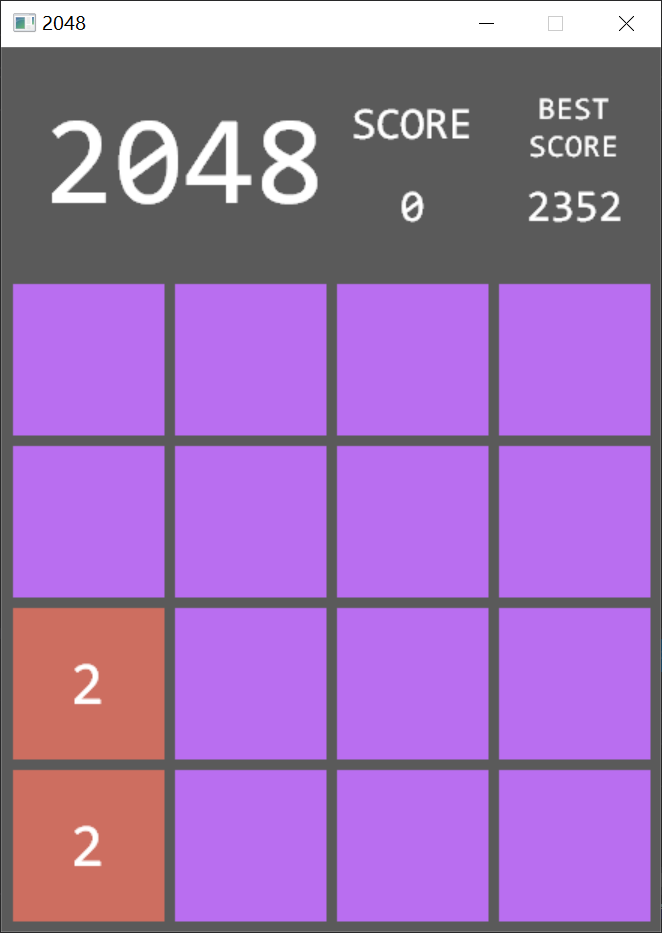
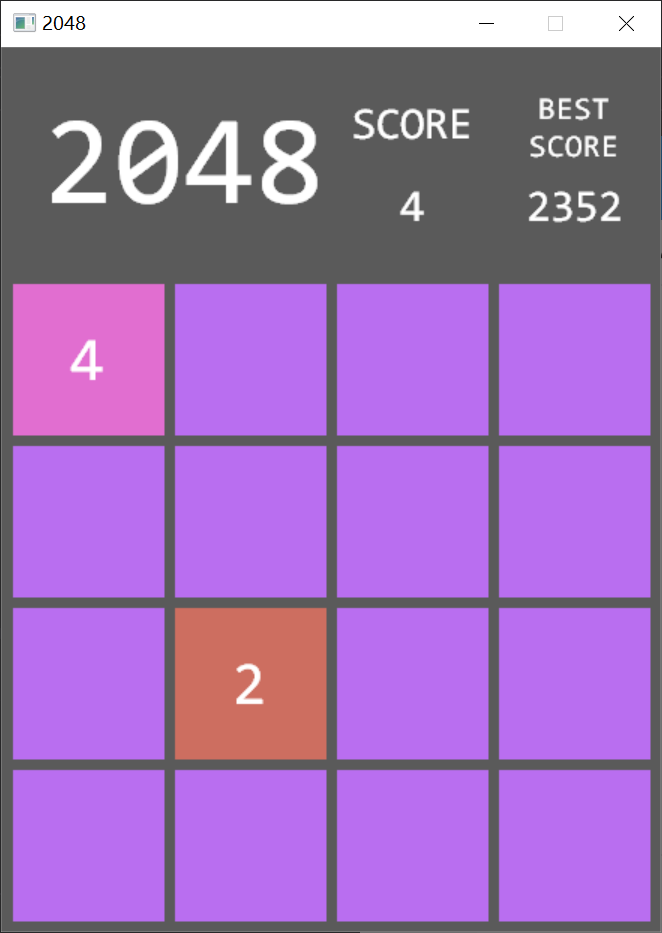
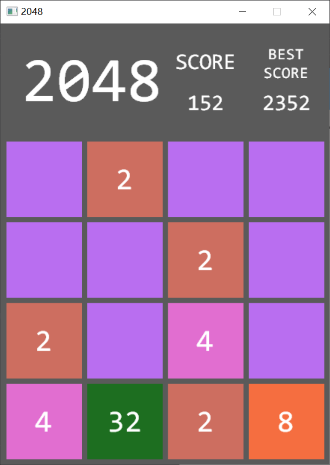
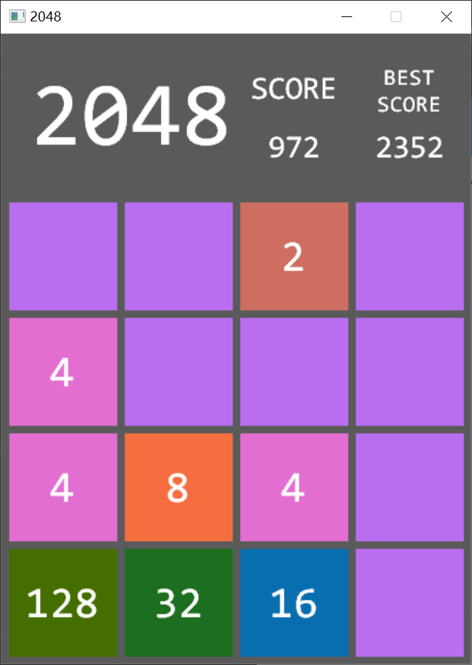
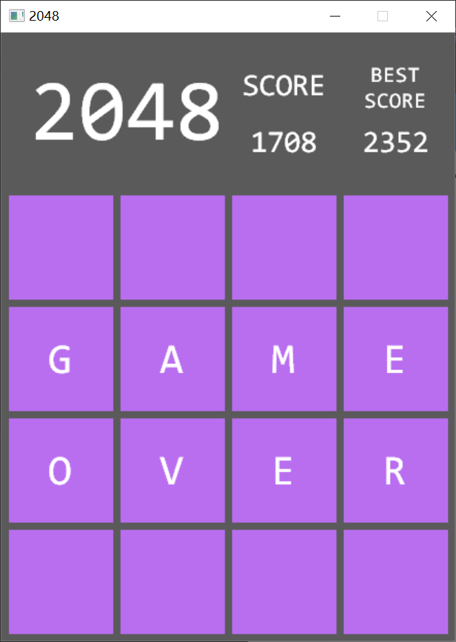
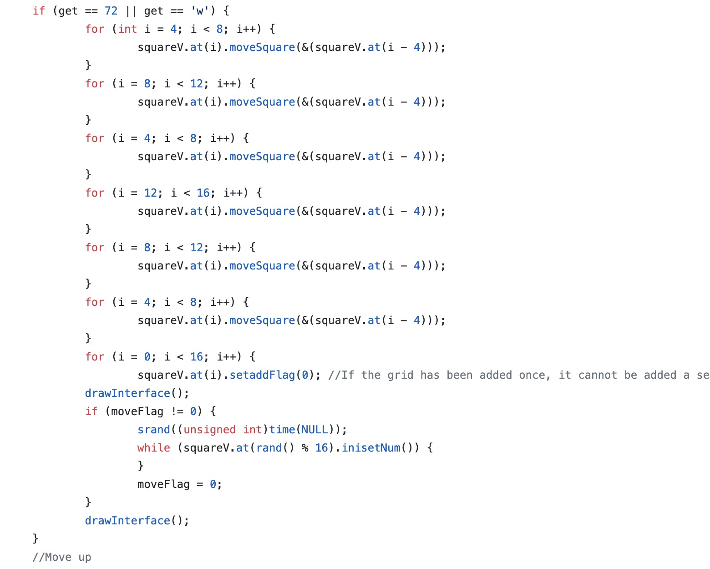

# Game2048
A computer Game called 2048 developed with C++.

Click the 2048.cpp to see the major codes.

Downloaded the 2048.project.zip and unzip it, run 2048.sln in your visual C++ 2017(EasyX installed) to show.
# Game Interaface

# Game Rules
1. Press '↑'，'←'，'→'，'↓' or 'W','A','D','S' on keyboard, and all the squre boxes will move in that direction.
2. Two cells of the same number will add up when they collide.
3. Each time you operate, a new num will be randomly appeared in the blank boxes.
4. When the interface is immovable (when the interface is full of numbers), the game ends; when the maximum number in the interface is 2048, you win!
5. Each time you make nums collided, the score would be added with the collided score.(if you collided two 4, score would add 8. if you collided two 512, the score would add 1024) My best score is 2352.

# Implementation of the game rules
1. Define a box as a class.

the interface is a 4*4 vector, and there are 16 boxes in this vector.
The private values in the class are the attributes of the box, including 4 private values of ‘up‘, ’down‘, ‘left’, and    ‘right’, which indicate the position of the box, ‘num’ represents the number in the box, and 'addFlag' indicates whether it can be added when two boxed collided. When addFlag is 1, the collided numbers could be added. When addFlag is 0, the two numbers couldn't be added although the boxes are collided.

2. Initialization of number setting:

Randomize a box and set it to 2. If there has been a number in this box, re-randomize a box and set it to 2.

3. Monitor the pressed button, and calculate how the boxes will move, and determine if the number in the box will be added according to whether the box collides and the addFlag value, and use the 'initialization of number setting' function to give a 2 to a random new box.

4. Calculate what the grids looks like after updating the 16 box classes in the vector and switching from the old grids to the new one.

5. Development the game interface with C++ external visualization tool EasyX.

# Core algorithm and code

Calculate how the boxes moved(move up in this example)

1. If an 'up' key is detected, the first line is not moved by default,

2. The first 'for' loop (second line -> first line)
Starting from the second line, check whether the second line can be moved to the first line (use moveSquare() to determine whether the boxes in the second line could be merged with the first line or just move to the first line directly).

3. The second and the third 'for' loop (third line -> first line)
Move the third line to the second line, and then move the second line to the first line.

4. The fourth, fifth, and sixth 'for' loop (fourth line -> first line)
Move the fourth line to the third line, and then move the third line to the second line, and fin
